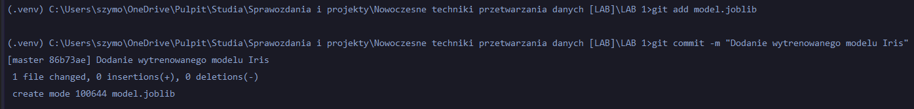
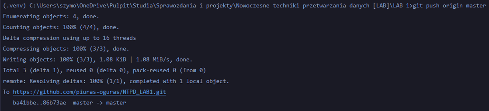
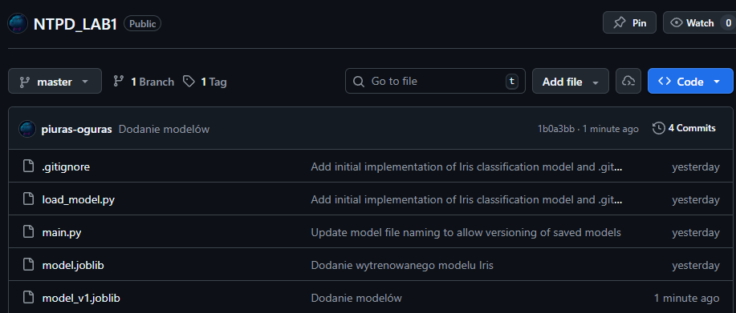
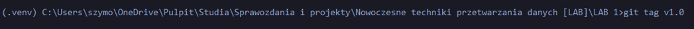
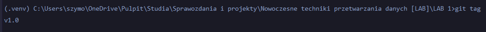
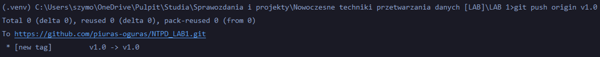

# Sprawozdanie nr 1
 <br>
**Nazwa ćwiczenia:** Tworzenie modelu ML w Pythonie. Zapisywanie i wersjonowanie modelu.<br>
**Przedmiot:** Nowoczesne techniki przetwarzania danych [LAB]<br>
**Student grupa:** Szymon Piórkowski, gr. I <br>
**Data ćwiczeń:** 4.03.2026 r. <br>
**Data oddania sprawozdania:** 8.03.2026 r. <br>

## 1. Cel ćwiczenia

Celem ćwiczenia było stworzenie modelu uczenia maszynowego w języku Python, a następnie zapisanie i wersjonowanie tego modelu. Ćwiczenie miało na celu zapoznanie się z procesem tworzenia modelu ML, jego trenowania oraz zarządzania wersjami modelu.

## 2. Przebieg ćwiczenia

### **Część właściwa zadania**


### Zadanie 1: Przygotowanie środowiska i danych


1. Stwórz nowe środowisko wirtualne w Pythonie (np. venv lub conda). Zainstaluj wymagane biblioteki: numpy, pandas, scikit-learn lub tensorflow, a także joblib (jeśli planujesz zapisywanie modelem w scikit-learn);


Na początku przygotowano środowisko wirtualne w Pythonie za pomocą komendy:


```PowerShell
python -m venv .venv
```

Pozwala nam to oddzielić zależności projektu od innych projektów znajdującym się na naszym komputerze. Następnie aktywowałem środowisko wirtualne za pomocą:


```PowerShell
.venv\Scripts\activate
```

Zainstalowałem wymagane biblioteki za pomocą pip:
* numpy — do obliczeń numerycznych,
* pandas — do pracy z danymi w formie DataFrame,
* scikit-learn - do tworzenia i trenowania modeli ML,
* joblib — do zapisywania modeli w formie pliku.


```PowerShell
pip install numpy pandas scikit-learn joblib
```

2. Pobierz lub załaduj wybrany zbiór danych. Możesz skorzystać się z wbudowanych zbiorów w
scikit-learn (np. load_iris, load_wine itp.) lub z pliku CSV (np. Titanic, House Prices, itp.);


Do analizy wykorzystałem wbudowany zbiór danych "Iris" dostępny w bibliotece scikit-learn. Zbiór ten zawiera informacje na temat trzech gatunków irysów na podstawie czterech cech:
* długość działki kielicha (sepal length),
* szerokość działki kielicha (sepal width),
* długość płatka (petal length),
* szerokość płatka (petal width).


```python
iris = load_iris()
```

Dane zostały załadowane do obiektu DataFrame z biblioteki pandas:


```python
df = pd.DataFrame(iris.data, columns=iris.feature_names)
```

Została dodana również kolumna z etykietami gatunków:


```python
df["target"] = iris.target
```

3. Dokonaj krótkiej analizy danych – wyświetl kilka pierwszych wierszy, informacje o rozmiarze
danych oraz typach kolumn w konsoli;

W ramach wstępnej analizy danych wykonano kilka podstawowych operacji:
* wyświetlenie pierwszych pięciu wierszy danych - `head() `


```
Kilka pierwszych wierszy:
    sepal length (cm)  sepal width (cm)  ...  petal width (cm)  target
0                5.1               3.5  ...               0.2       0
1                4.9               3.0  ...               0.2       0
2                4.7               3.2  ...               0.2       0
3                4.6               3.1  ...               0.2       0
4                5.0               3.6  ...               0.2       0

[5 rows x 5 columns]
```

* sprawdzenie rozmiaru zbioru oraz typów kolumn przy użyciu `info()`


```
Informacja na temat rozmiaru danych oraz typach danych w kolumnach:
<class 'pandas.DataFrame'>
RangeIndex: 150 entries, 0 to 149
Data columns (total 5 columns):
 #   Column             Non-Null Count  Dtype
---  ------             --------------  -----
 0   sepal length (cm)  150 non-null    float64
 1   sepal width (cm)   150 non-null    float64
 2   petal length (cm)  150 non-null    float64
 3   petal width (cm)   150 non-null    float64
 4   target             150 non-null    int64
dtypes: float64(4), int64(1)
memory usage: 6.0 KB
```

* wyświetlenie podstawowych statystyk opisowych dla cech numerycznych za pomocą `describe()`


```
Statystyka kolumn:
        sepal length (cm)  sepal width (cm)  ...  petal width (cm)      target
count         150.000000        150.000000  ...        150.000000  150.000000
mean            5.843333          3.057333  ...          1.199333    1.000000
std             0.828066          0.435866  ...          0.762238    0.819232
min             4.300000          2.000000  ...          0.100000    0.000000
25%             5.100000          2.800000  ...          0.300000    0.000000
50%             5.800000          3.000000  ...          1.300000    1.000000
75%             6.400000          3.300000  ...          1.800000    2.000000
max             7.900000          4.400000  ...          2.500000    2.000000

[8 rows x 5 columns]
```

### Zadanie 2: Stworzenie prostego modelu ML (wariant A)


1. Podziel zbiór danych na treningowy i testowy (np. 80% / 20%) korzystając z train_test_split

Przygotowano dane do trenowania modelu poprzez rozdział zmiennych wejściowych od zmiennych docelowych. Zmienne wejściowe (X) zawierają cechy roślin, natomiast zmienna docelowa (y) zawiera etykietę gatunku irisa:


```python
X = df.drop("target", axis=1)
y = df["target"]
```

Podzielono zbiór danych na część treningową i testową w proporcji 80% / 20% za pomocą funkcji train_test_split z biblioteki scikit-learn:


```python
X_train, X_test, y_train, y_test = train_test_split(X, y, test_size=0.2, random_state=42)
```

2. Wybierz prosty algorytm (np. LogisticRegression, RandomForestClassifier lub LinearRegression w
zależności od typu problemu: klasyfikacja/regresja)

Do klasyfikacji wykorzystano algorytm regresji logistycznej:


```python
model = LogisticRegression(max_iter=1000)
```

3. Wytrenuj model i wyświetl podstawowe metryki (np. accuracy, precision, recall, R^2, itp.
w zależności od problemu).

Model został wytrenowany za pomocą metody `fit()`. Po zakończeniu trenowania modelu wykonano predykcję na zbiorze testowym za pomocą metody `predict()`.:


```python
model.fit(X_train, y_train)
y_pred = model.predict(X_test)
```

Obliczono podstawowe metryki oceny modelu:
* accuracy — procent wszystkich predykcji, które zostały poprawnie zidentyfikowane,


```
Dokładność: 1.0
```

* precision — jak dokładne są pozytywne predykcje modelu


```
Precyzja: 1.0
```

* recall — jak dobrze model znajduje wszystkie przypadki danej klasy


```
Czułość: 1.0
```

* f1-score - średnia harmoniczna precision i recall


```
F1-score: 1.0
```

* confusion matrix — macierz pomyłek pokazująca liczbę poprawnych i błędnych klasyfikacji


```
Macierz pomyłek :
 [[10  0  0]
 [ 0  9  0]
 [ 0  0 11]]

```

Dodatkowo wyświetlono pełny raport klasyfikacji, który zawiera metryki dla każdej klasy:


```
Raport klasyfikacji:
               precision    recall  f1-score   support

           0       1.00      1.00      1.00        10
           1       1.00      1.00      1.00         9
           2       1.00      1.00      1.00        11

    accuracy                           1.00        30
   macro avg       1.00      1.00      1.00        30
weighted avg       1.00      1.00      1.00        30
```

### Zadanie 3: Zapisanie i ładowanie modelu (pickle, joblib)


1. Zapisz wytrenowany model do pliku (np. model.pkl lub model.joblib) korzystając z
biblioteki pickle lub joblib.


Wytrenowany model zapisuje do pliku przy użyciu biblioteki joblib:


```python
joblib.dump(model, "model_v1.joblib")
```

2. Utwórz osobny skrypt (np. load_model.py), w którym wczytasz zapisany model i
wykonasz predykcję dla przykładowego rekordu, by potwierdzić, że model się poprawnie
ładuje i działa.

Tworzę osobny skrypt `load_model.py`, który wczytuje zapisany model i wykonuje predykcję dla przykładowego rekordu:


```python
model = joblib.load('model_v1.joblib')
example = pd.DataFrame([[5.1, 3.5, 1.4, 0.2]],columns=["sepal length (cm)","sepal width (cm)","petal length (cm)","petal width (cm)"])
prediction = model.predict(example)
```

### Zadanie 4: Wersjonowanie modelu w praktyce


1. Dodaj plik z modelem do repozytorium Git.

Dodaje model do repozytorium Git:




Dodanie modelu do repozytorium Git zostało zrealizowane poprawnie, co zostało potwierdzone widocznością w serwisie github:



Link do zdalnego repozytorium: [Repozytorium GitHub](https://github.com/piuras-oguras/NTPD_LAB1)

2. Utwórz etykietę/tag (np. v1.0) w repozytorium, aby oznaczyć konkretną wersję modelu.

Tworzę etykietę/tag `v1.0` w repozytorium Git, aby oznaczyć konkretną wersję modelu:



Sprawdzam poprawność wykonania komendy:



Następnie wysyłam zmiany do zdalnego repozytorium:


3. Zaimplementuj w praktyce prostą politykę wersjonowania modelu (np. nazewnictwo plików
model_v1.joblib, model_v2.joblib) i opisz, kiedy należy podnieść wersję modelu (np. zmiana
hiperparametrów, poprawa jakości, zmiana zakresu danych).

Zastosowałem strategię wersjonowania modelu poprzez nazewnictwo plików. Każda nowa wersja modelu jest zapisywana z unikalną nazwą, która musi zawierać numer wersji. Na przykład: `model_v1.joblib`, `model_v2.joblib`, `model_v3.joblib` itd.


```python
joblib.dump(model, "model_v2.joblib")
```

Podnoszenie wersji modelu powinno nastąpić w następujących sytuacjach kiedy: zmieniono hiperparametry modelu, zastosowany inny algorytm ML, poprawiono jakość modelu (np. poprzez zwiększenie dokładności, precyzji, recall itp.), dodano nowe dane treningowe, zmieniono zakres danych lub strukturę danych, wprowadzono jakiekolwiek istotne zmiany w procesie trenowania modelu, które mogą znacząco wpłynąć na jego działanie lub wynik.

### Zadanie 5: Różnice między środowiskiem deweloperskim a produkcyjnym


Opracuj listę różnic i wyzwań, które pojawiają się przy wdrażaniu modelu ML w środowisku
produkcyjnym w porównaniu do środowiska deweloperskiego. Podaj przykłady, jak radzić sobie z tymi
różnicami (monitorowanie modelu w produkcji, retraining, zarządzanie zależnościami, automatyzacja
wdrożeń).

* Pierwszym problemem, który się pojawia jest zarządzanie zależnościami. W środowisku deweloperskim często programista może mieć zainstalowane różne wersje bibliotek na komputerze. W środowisku produkcyjnym, gdzie model jest wdrażany wszystkie zależności muszą być dokładnie określone, aby model działał tak samo poprawnie, jak podczas trenowania. Rozwiązaniem tego problemu jest stosowanie środowisk wirtualnych, plików requirements.txt lub narzędzi takich jak Docker.

* Kolejnym wyzwaniem jest monitorowanie modelu na produkcji. W środowisku produkcyjnym często pracuje się na nowych danych, które się różnią od treningowych, co może powodować spadek jakości predykcji. Ważne jest monitorowanie działania modelu, na przykład poprzez analizę metryk modelu.
<br>
* Następnym problemem jest aktualizacja modelu i ponowne jego trenowanie. Dane zmieniają się w czasie, dlatego model może przestać dobrze działać. Dlatego ważne jest ponowne trenowanie modelu na nowszych danych. W praktyce tworzy się pipeline, który automatycznie zbiera nowe dane i okresowo trenuje nową wersję modelu.

* Istotną różnicą jest automatyzacja wdrożeń modelu. W środowisku deweloperskim model jest uruchamiany ręcznie, natomiast w środowisku produkcyjnym wdrażanie nowych wersji powinno być zautomatyzowane. W tym celu stosuje się narzędzia CI/CD.


## 3. Wnioski
* Wirtualne środowisko w Pythonie pozwala odseparować biblioteki używane w projekcie od innych bibliotek znajdujących się na komputerze.  
* Biblioteka scikit-learn pozwala na szybkie tworzenie i trenowanie prostych modeli ML.
* Metryki oceny modelu pozwalają ocenić jakość działania modelu i zidentyfikować potencjalne problemy.
* Wersjonowanie modelu pozwala kontrolować zmiany w projekcie oraz łatwo wracać do wcześniejszych wersji.
* Wdrażanie modelu w środowisku produkcyjnym wiąże się z dodatkowymi wyzwaniami takimi jak monitorowanie działania modelu, zarządzanie zależnościami oraz automatyzacja procesu wdrożenia.  

